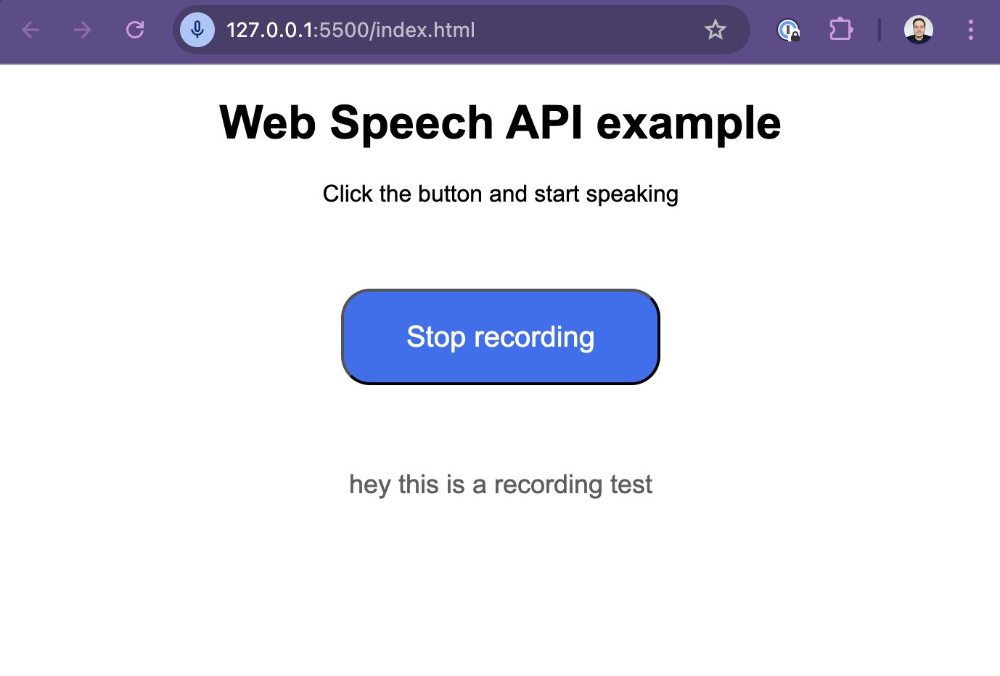

# Speech recognition in the browser using Web Speech API

Simple app that shows how to do speech recognition in the browser using the [Web Speech API](https://developer.mozilla.org/en-US/docs/Web/API/Web_Speech_API).

Preview:

